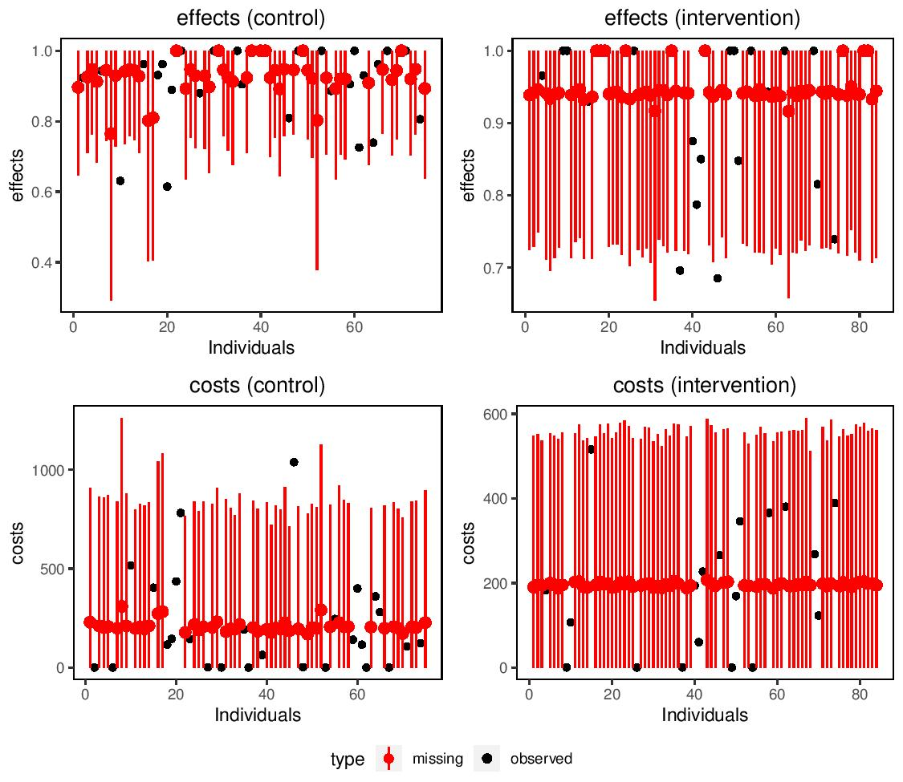

`missingHE` is a `R` package aimed at providing some useful tools to analysts in order to handle missing outcome data under a Full Bayesian framework in economic evaluations. The package relies on the `R` package `R2jags` to implement Bayesian methods via the statistical software `JAGS`. The package allows to obtain inferences using Markov Chain Monte Carlo (MCMC) methods under a range of modelling approaches and missing data assumptions. The package also contains functions specifically defined to assess model fit and possible issues in model convergence as well as to summarise the main results from the economic analysis.


Missing data are iteratively imputed using data augmentation methods according to the type of model, distribution and missingness assumptions specified by the user using different arguments in the functions of the package. The posterior distribution of the main quantities of interest (e.g. some suitable measures of costs and clinical benefits) is then summarised to assess the cost-effectiveness of a new intervention ($t=2$) against a standard intervention ($t=1$).


`missingHE` produces plots which compares the observed and imputed values for both cost and benefit measures in each treatment intervention considered to detect possible concerns about the plausibility of the imputation methods. In addition, the output of `missingHE` cab be analysed using different funtions in the `R` package `BCEA` which produces a synthesis of the decision process given the current evidence and uncertainty, as well as several indicators that can be used to perform Probabilistic Sensitivity Analysis to parameter and model uncertainty. 





# Example

```r
library(missingHE)
model.sel <- selection(data = MenSS, model.eff = e ~ u.0, model.cost = c ~ e, model.me = me ~ 1, model.mc = mc ~ 1, 
                       type = "MAR", n.chains = 2, n.iter = 10000, n.burnin = 1000, dist_e = "norm", dist_c = "norm")
summary(model.sel)
```

```r
 Cost-effectiveness analysis summary 
 
 Comparator intervention: intervention 1 
 Reference intervention: intervention 2 
 
 Parameter estimates under MAR assumption
 
 Comparator intervention 
               mean     sd      LB      UB
mean.effects  0.874  0.017   0.846   0.901
mean.costs   238.34 52.432 153.541 325.355

 Reference intervention 
                  mean    sd      LB      UB
mean.effects.1   0.917 0.022   0.881   0.953
mean.costs.1   186.825 41.26 119.672 254.125

 Incremental results 
                   mean     sd       LB     UB
delta.effects     0.043  0.028   -0.003  0.089
delta.costs     -51.514 67.025 -162.862 58.327
ICER          -1198.431
```


# Installation


There are two ways of installing `missingHE`. A *stable* version (currently 1.1.1) is packaged and available from [CRAN](https://cran.r-project.org/web/packages/missingHE/). You can simply type on your `R` terminal


```r
install.packages("missingHE")
```

The second way involves using the *development* version of `missingHE`, which is available from [GitHub](https://github.com/AnGabrio/missingHE) - this will usually be updated more frequently and may be continuously tested. On Windows machines, you need to install a few dependencies, including Rtools first, e.g. by running


```r
pkgs <- c("R2jags","Rtools","devtools")
```


before installing the package using `devtools`:


```r
devtools::install_github("AnGabrio/missingHE")
```


